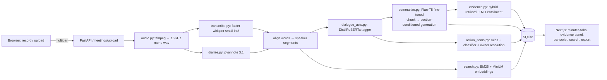

# BLUEPRINT — AI Meeting Summarizer (NLP)

**Evidence-grounded structured minutes from meeting audio, with a small fine-tuned model that runs offline.**

Team: Krishna · Lahari · Mounika · Companion to `PROJECT_PLAN.md` (what to build, when) — this file is
*how the system is designed and why*. Read this before the viva.

---

## 1. Problem statement

Meetings produce long, multi-speaker, disfluent spoken language. Existing tools either (a) send audio to a
cloud model and return an unverifiable paragraph, or (b) run an extractive method that misses decisions. We
want a system that:

1. works **offline**, so audio and transcripts never leave the machine;
2. produces **structured minutes** — *Decisions · Action items (with owners) · Open problems* — instead of one blob;
3. makes every generated sentence **checkable**: it is linked to the transcript turns that support it and scored
   for faithfulness, with unsupported sentences flagged;

4. is built from **models we fine-tune and evaluate ourselves**, with every number reproducible from the repo.

The academic contribution is not "a summariser exists"; it is the **experimental comparison** of how a small
model should be fed and controlled (chunking, speaker tags, dialogue-act filtering, section conditioning) and
whether an NLI grounding layer can be trusted to flag its mistakes.

---

## 2. System architecture



```
  ┌──────────── laptop / one docker compose ────────────┐
  │  frontend (Next.js) ──HTTP──▶ backend (FastAPI)      │
  │                                  │ BackgroundTask    │
  │   stages: transcribing → diarizing → summarizing →   │
  │           tagging → linking → done                   │
  │   models (all local, MODEL_DIR):                     │
  │     whisper-small int8 · pyannote-3.1 · flan-t5-base │
  │     (ours) · distilroberta-mrda (ours) · MiniLM ·    │
  │     nli-deberta-v3-base · distilbert-actions (ours)  │
  └──────────────────────────────────────────────────────┘
        no outbound network calls after weight download
```

**Non-goals**: streaming, multilingual, mobile, chat over meetings. They go in Future Work.

---

## 3. Data flow and storage

| Stage | Input | Output | Persisted as |
|-------|-------|--------|--------------|
| audio | any container | 16 kHz mono wav | `data/audio/<hash>.wav` |
| transcribe | wav | words with timestamps | `data/transcripts/<hash>.json` (cache) |
| diarize | wav | speaker turns | same json |
| align + merge | words, turns | `segments[{id, speaker, start, end, text}]` | `transcript_segments` |
| dialogue acts | segments (+prev) | label per segment | `transcript_segments.dialogue_act` |
| summarize | filtered segments | `summary`, `minutes{decisions, actions, problems}` sentence lists | `minute_items(section, text)` |
| action items | statement segments | items with owner, due, source segment, confidence | `action_items` |
| evidence | minute sentences × segments | top-5 supporting segments + entailment, `supported` | `evidence`, `minute_items.entailment` |
| embeddings | segments | MiniLM vectors, BM25 postings | `segment_embeddings`, in-memory BM25 |

Tables: `users, meetings(status, stage_timings, faithfulness_score), transcript_segments, minute_items,
action_items, evidence, segment_embeddings`. SQLite; one file; gitignored.

---

## 4. NLP component blueprint

### 4.1 Speech front end (Mounika) — input, not a contribution

- **ASR**: faster-whisper `small`, `compute_type=int8`, VAD filter, word timestamps. Chosen over `base` for
  proper-noun accuracy (names become action-item owners) and over `medium` for CPU time.

- **Diarisation**: pyannote `speaker-diarization-3.1`; words assigned to the overlapping speaker turn; consecutive
  same-speaker turns merged; turns < 0.6 s attached to the neighbour. Output is the `Speaker: text` line format
  the summariser was trained on.

- **Why local**: the privacy claim is only true if nothing leaves the machine. A cloud ASR would invalidate it.

### 4.2 Summarisation model (Lahari) — core contribution 1

- **Backbone**: `google/flan-t5-base` (250M). Instruction-tuned, so a `summarize <section>:` prefix is natural;
  fits Kaggle T4 at 1024-token inputs; small enough for int8 CPU inference.

- **Curriculum**: SAMSum (short chat dialogues, 14.7k) → AMI (real meetings, ~140 with abstractive summaries)
  → AMI *sections* (+ QMSum decision/action queries if needed). Each stage continues from the previous checkpoint.

- **Long input**: `chunking.py` splits on speaker turns into ~800-token windows with 100-token overlap;
  chunk summaries are concatenated and summarised again (hierarchical). Ablated at 512/800/1024.

- **Section conditioning**: one model, three prompts — `summarize decisions:`, `summarize actions:`,
  `summarize problems:` — trained on AMI's manually written section summaries. This is query-focused
  summarisation with a fixed query set; no separate model per section.

- **Input filtering**: before generation, segments tagged *backchannel* or *floor-grabber* are dropped (S-C).
  The hypothesis: a small model wastes capacity on "yeah, uh-huh, okay so"; removing them helps precision on
  decisions. This is the ablation the faculty will remember.

- **Efficiency**: LoRA (r=16, q/v projections) vs full fine-tuning on the same data and epochs; int8 dynamic
  quantisation at inference.

### 4.3 Dialogue-act tagger (Krishna) — core contribution 2

- **Data**: MRDA (ICSI meeting corpus dialogue acts) via the `silicone` benchmark, 5 basic labels:
  statement, question, backchannel, floor-grabber, disruption. Meetings, not phone calls — matches our domain.

- **Model**: `distilroberta-base` sequence classifier on `prev_utterance [SEP] utterance`; baseline TF-IDF +
  logistic regression for the ablation table. Macro-F1 and confusion matrix reported.

- **Used by**: summariser input filter (4.2), action-item candidate gate (4.4), transcript colouring in the UI,
  and a "talk-time / question share per speaker" mini-analytics card (cheap, impressive).

### 4.4 Action items with owner resolution (Krishna) — core contribution 3

- **Candidate gate**: segment tagged *statement* AND (imperative root verb OR commitment pattern).
- **Classifier**: TF-IDF+LR and DistilBERT on ~300 hand-labelled AMI statements; final = rules ∧ classifier ≥ 0.5.
- **Owner**: first person ("I'll") → the speaker; second person ("can you") → the previous *other* speaker;
  explicit PERSON entity overrides; due date via `dateparser`. Owner accuracy is its own metric.

- **Traceability**: every item stores `source_segment_id`; the UI scrolls to it.

### 4.5 Evidence linking and faithfulness (Mounika) — core contribution 4

- **Retrieve**: for each minute sentence, top-5 segments by reciprocal-rank fusion of BM25 and MiniLM cosine
  (the same scorer as search).

- **Verify**: `cross-encoder/nli-deberta-v3-base`; premise = segment ± one neighbouring segment, hypothesis =
  the minute sentence; take max entailment probability over the 5 candidates.

- **Decide**: `supported = max_entailment ≥ τ`, τ tuned on a 60-sentence dev set the team labels.
  Meeting-level faithfulness = mean of max-entailment (SummaC-ZS style).

- **Evaluate**: (i) faithfulness score per system on AMI test; (ii) Spearman ρ against rater factuality
  in the human eval; (iii) precision/recall of the *unsupported* flag on the labelled sentences.

- **UI**: click any minute sentence → supporting turns with entailment bars; flagged sentences get a badge.
  This is the moment in the demo where people say "oh, that's useful".

### 4.6 Hybrid search (Mounika)

- BM25 over segments + MiniLM dense vectors, fused by RRF; evaluated with hits@5 / MRR against 25 labelled
  queries on the 20-minute recording; four rows: substring, BM25, dense, hybrid.

---

## 5. Data and licences (verify on Day 1, record in `data/README.md`)

| Dataset | Use | Source | Notes |
|---------|-----|--------|-------|
| SAMSum | stage-1 fine-tune | HF `Samsung/samsum` | CC BY-NC-ND — research use, cite |
| DialogSum | extra dialogue data / fallback | HF `knkarthick/dialogsum` | CC BY-NC-SA |
| AMI abstractive summaries | stage-2 fine-tune, test set | HF `knkarthick/AMI` (plain) + AMI manual annotations v1.6.2 (NXT XML) for sections | CC BY 4.0 |
| QMSum | section fallback / augmentation | GitHub Yale-LILY/QMSum | includes AMI + ICSI meetings; avoid test leakage into AMI test |
| MRDA | dialogue-act tagger | HF `silicone` (`mrda`) | ICSI meetings |
| Own recordings | demo, search eval, human eval | `demo/sample_audio/` + one 20-min meeting | team consent recorded in `docs/decisions.md` |

**Leakage rule**: AMI test meetings are held out from every training stage, including QMSum augmentation
(filter by meeting id).

---

## 6. Training design (all on Kaggle GPUs)

| Run | Base | Data | Epochs | Approx. T4 time | Output |
|-----|------|------|--------|-----------------|--------|
| samsum-full | flan-t5-base | SAMSum | 3 | 2–3 h | `ours/flan-t5-base-samsum` |
| ami-full | samsum-full | AMI | 5 | 1 h | `ours/flan-t5-base-ami` |
| ami-lora | samsum-full | AMI | 5 | 40 min | ablation row |
| sections-full | ami-full | AMI sections (+QMSum) | 5 | 1–2 h | `ours/flan-t5-base-minutes` (shipped) |
| ablations | ami-full | AMI, tags/fillers/chunk grid | 3 each | 3 h total | `ablations.csv` |
| mrda-da | distilroberta-base | MRDA | 3 | 30 min | `ours/distilroberta-mrda` |
| actions-cls | distilbert-base | 300 labelled | 5 | 5 min | `ours/distilbert-actions` |

Budget ≈ 12 GPU-hours against ≈ 360 available over four weeks with three accounts. Every run pushes the checkpoint
to the Hub each epoch and is resumable.

---

## 7. Evaluation design

| Table | Systems | Metrics | Split |
|-------|---------|---------|-------|
| `summarization_results` | extractive (TextRank) · zero-shot flan-t5 · +SAMSum · +AMI · LoRA · LED (stretch) · LLM baseline (offline) | ROUGE-1/2/L, BERTScore | AMI test |
| `ablations` | speaker tags on/off · filler removal on/off · chunk 512/800/1024 · LoRA vs full | ROUGE-L, trainable params, GPU-h | AMI test |
| `structured_minutes` | S-A generic-split · S-B section-conditioned · S-C section-conditioned + DA-filtered | ROUGE-L, BERTScore per section | AMI test sections |
| `dialogue_act_eval` | TF-IDF+LR · DistilRoBERTa | macro-F1, per-class F1, confusion | MRDA test |
| `action_item_eval` | rules · classifier · rules∧classifier | P/R/F1; owner accuracy | 300 labelled |
| `factuality` | all summariser rows | mean max-entailment, % unsupported; flag P/R on labelled sentences | AMI test + dev labels |
| `human_eval` | S-C · generic · LLM (blind) | coherence, coverage, factuality 1–5 × 3 raters; ρ(score, factuality) | 10 meetings |
| `search_eval` | substring · BM25 · dense · hybrid | hits@5, MRR | 25 queries |
| `latency` | fp32 vs int8 summariser; every stage | seconds per 20-min meeting, MB | laptop CPU |

Every table is generated by a script; hand-typed numbers are rejected in review.

---

## 8. The claims table (write toward it from day one)

| Claim | Evidence | Week |
|-------|----------|------|
| A 250M model adapted SAMSum→AMI with turn-based chunking is competitive on real meetings | ROUGE/BERTScore rows, gap to LLM baseline stated | 1–2 |
| Section-conditioned generation beats a generic summary for decisions/actions/problems | S-A vs S-B per-section table | 3 |
| Dialogue-act filtering of the input helps a small model | S-B vs S-C; DA tagger F1 | 2–3 |
| The faithfulness score is trustworthy | ρ with human factuality; flag precision on labelled sentences | 3–4 |
| LoRA and int8 are nearly free | ablation and latency rows | 2, 4 |
| It runs offline on a laptop | stage timings; demo with network off | 1, 4 |

---

## 9. Viva preparation — the questions a core-NLP examiner will ask

1. **"What is novel here? Summarisers exist."** — Not the summariser: the controlled comparison of *how to feed
   a small model* (chunking, tags, dialogue-act filtering, section prompts) and the *NLI grounding layer that
   flags its own errors*, evaluated against human judgments. Point at `structured_minutes.md` and `factuality.md`.

2. **"Why Flan-T5-base and not an LLM?"** — Privacy (offline), cost (zero per meeting), and it is *ours*: we can
   ablate and explain every design choice. The LLM row is in the table so the trade-off is honest.

3. **"How do you handle inputs longer than 1024 tokens?"** — Speaker-turn chunking with overlap, hierarchical
   second pass; ablated at three sizes; LED tried as a long-context comparison.

4. **"What are dialogue acts and why do they matter for summarisation?"** — Functional labels of utterances
   (statement, question, backchannel…). Meetings are ~30 % backchannel/floor-grabbing; removing it changes what a
   small model attends to. We measured it.

5. **"How do you know the summary is faithful?"** — Retrieval + NLI entailment per sentence, threshold tuned on
   labelled data, correlated with three human raters. We also show its failure modes (true-but-unsupported).

6. **"Why is ROUGE a bad metric here?"** — Lexical overlap ignores paraphrase and factuality; that is exactly why
   we add BERTScore, NLI faithfulness and human ratings.

7. **"Could the model have seen the test set?"** — AMI test ids are excluded from every training stage, including
   QMSum augmentation; the filter is in `prepare.py` and tested.

8. **"What would you do with three more months?"** — Coreference for owner resolution, multilingual ASR, streaming
   summarisation, a learned re-ranker for evidence retrieval.

9. **"What did *you* personally build?"** — Each member answers with their §4 subsection, their branches, their
   weekly docs, and their numbers.

**One-liners to memorise**

- *On novelty*: "We don't claim a better summariser; we show how to control a small one and how to catch it lying."
- *On scale*: "A frontier model wins on ROUGE by X points; ours runs on this laptop with the Wi-Fi off and tells you which sentence not to trust."
- *On rigour*: "Every number in the report is produced by a script in the repo; you can regenerate the tables from the checkpoints."

---

## 10. Definition of done (v1.0)

- `docker compose up` on a clean machine → seeded demo runs with the network disabled.
- All nine benchmark files present and regenerable; `docs/results.md` frozen.
- Public model card, README with GIF and results table, demo video.
- Twelve weekly branches, twelve weekly docs, four gate tags, `v1.0`.
- Only three names in the contributor graph.
